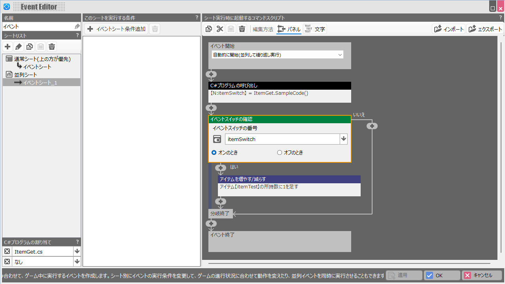

**Notes**
* English translation by ChatGPT.
* This is only a sample script.

## how to use
- First, identify the target area's X and Z coordinate ranges.

- Set those values in MIN_X, MAX_X, MIN_Z, and MAX_Z in the attached .cs file.
- Create an event inside the target area.
- Call the C# command from a Parallel Process event sheet.
- The command returns a value, so store it in a variable and use a Conditional Branch to handle the result.
